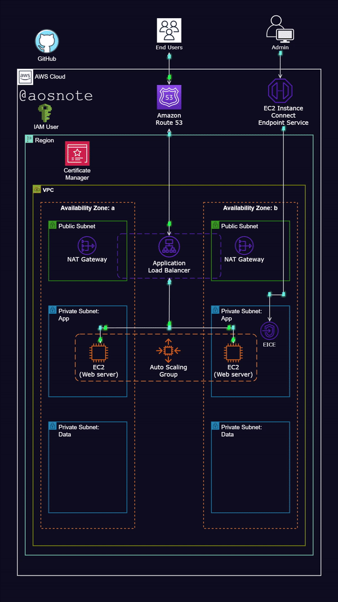

# Deployment of a Highly available Static Website on AWS



In this project, I deployed a static website on AWS using the AWS Management Console, creating a secure, scalable, and highly available web application architecture. Below, I report the steps I took and the reasoning behind my decisions.

## Architecture Overview

I designed the architecture within the AWS Cloud, assigning descriptive names to each component for clarity:

- **AWS Cloud**: I used this to host all resources.
- **VPC**: I named it `WebAppVPC` to serve as the virtual network.
- **Availability Zones**: I referred to them as `AZ-a` (e.g., us-east-1a) and `AZ-b` (e.g., us-east-1b).
- **Public Subnets**:
  - I created `Frontend-Public-Subnet-AZ-a` for AZ-a.
  - I created `Frontend-Public-Subnet-AZ-b` for AZ-b.
- **Private Subnets (App Layer)**:
  - I set up `App-Private-Subnet-AZ-a` for AZ-a.
  - I set up `App-Private-Subnet-AZ-b` for AZ-b.
- **Private Subnets (Data Layer)**:
  - I established `Data-Private-Subnet-AZ-a` for AZ-a.
  - I established `Data-Private-Subnet-AZ-b` for AZ-b.
- **IAM User**: I called it `WebAppAdmin` to manage resources.
- **Certificate Manager**: I named it `WebAppSSLCertificate` to secure traffic.
- **Route 53**: I labeled it `WebAppDomain` for DNS (e.g., mywebapp.com).
- **EC2 Instance Connect Endpoint**: I named it `WebAppConnectEndpoint` for secure EC2 access.
- **Application Load Balancer**: I referred to it as `WebAppALB` to distribute traffic.
- **Auto Scaling Group**: I called it `WebAppAutoScalingGroup` to manage EC2 scaling.
- **EC2 Instances**: I named them `WebAppServer` as the web servers.
- **NAT Gateways**:
  - I set up `NAT-Gateway-AZ-a` for AZ-a.
  - I set up `NAT-Gateway-AZ-b` for AZ-b.

I chose descriptive names to make resource management and troubleshooting easier, as they clearly indicated each component’s purpose and location.

## Prerequisites

To complete this project, I needed:
- An AWS account, where I used the Free Tier to minimize costs.
- A basic understanding of AWS services like VPC, EC2, and Route 53.

## Steps I Took

### Step 1: Setting Up My AWS Account and IAM User

I began by signing up for an AWS account at [aws.amazon.com](https://aws.amazon.com), providing billing information and opting for the Free Tier. I then created an IAM user named `WebAppAdmin` in the AWS Management Console, enabling both Programmatic access and AWS Management Console access. I set a custom password, requiring a change on first login for security.

For permissions, I attached policies including `AmazonVPCFullAccess`, `AmazonEC2FullAccess`, `AmazonRoute53FullAccess`, `AWSCertificateManagerFullAccess`, and `AmazonEC2InstanceConnectFullAccess`. I considered using `AdministratorAccess` for simplicity but stuck with specific policies to follow the principle of least privilege. After creating the user, I downloaded the credentials for programmatic access and logged in as `WebAppAdmin`, avoiding the root user for daily operations.

### Step 2: Setting Up the VPC

I created a VPC named `WebAppVPC` with an IPv4 CIDR block of `10.0.0.0/16` to provide an isolated network environment. I then set up six subnets across two Availability Zones to ensure high availability:
- `Frontend-Public-Subnet-AZ-a`: `10.0.1.0/24`, AZ: `us-east-1a`.
- `Frontend-Public-Subnet-AZ-b`: `10.0.2.0/24`, AZ: `us-east-1b`.
- `App-Private-Subnet-AZ-a`: `10.0.3.0/24`, AZ: `us-east-1a`.
- `App-Private-Subnet-AZ-b`: `10.0.4.0/24`, AZ: `us-east-1b`.
- `Data-Private-Subnet-AZ-a`: `10.0.5.0/24`, AZ: `us-east-1a`.
- `Data-Private-Subnet-AZ-b`: `10.0.6.0/24`, AZ: `us-east-1b`.

I added an Internet Gateway named `WebAppIGW` and attached it to `WebAppVPC` to enable internet access for public subnets. I created two route tables: `Frontend-Public-RouteTable` for public subnets and `App-Private-RouteTable` for private subnets, associating the respective subnets. For the public route table, I added a route (`0.0.0.0/0` → `WebAppIGW`) to allow internet traffic.

To enable private subnets to access the internet securely, I created NAT Gateways: `NAT-Gateway-AZ-a` in `Frontend-Public-Subnet-AZ-a` and `NAT-Gateway-AZ-b` in `Frontend-Public-Subnet-AZ-b`, each with an Elastic IP. I updated the `App-Private-RouteTable` to route `0.0.0.0/0` to `NAT-Gateway-AZ-a`, ensuring high availability.

### Step 3: Setting Up Security Groups

I created three security groups to control traffic:
- `WebAppALB-SecurityGroup`: I allowed inbound HTTP (port 80) and HTTPS (port 443) from `0.0.0.0/0` to accept public web traffic.
- `WebAppServer-SecurityGroup`: I permitted inbound HTTP (port 80) only from `WebAppALB-SecurityGroup` to restrict access to the ALB.
- `WebAppConnect-SecurityGroup`: I allowed inbound SSH (port 22) from the VPC CIDR (`10.0.0.0/16`) for secure EC2 access.

These configurations ensured that only legitimate traffic reached my resources, enhancing security.

### Step 4: Setting Up the EC2 Instance Connect Endpoint

I created an EC2 Instance Connect Endpoint named `WebAppConnectEndpoint` in `WebAppVPC`, selecting the EC2 Instance Connect Endpoint type. I assigned it the `WebAppConnect-SecurityGroup` and placed it in `App-Private-Subnet-AZ-a`. This allowed me to securely access EC2 instances in private subnets without public IPs or SSH keys, aligning with my security-focused design.

### Step 5: Setting Up the Application Load Balancer

I created an Application Load Balancer named `WebAppALB`, setting it as internet-facing with an HTTP listener on port 80. I placed it in `WebAppVPC`, using `Frontend-Public-Subnet-AZ-a` and `Frontend-Public-Subnet-AZ-b` for high availability, and assigned `WebAppALB-SecurityGroup`. I also created a target group named `WebAppTargetGroup` with HTTP protocol on port 80 and default health checks to ensure traffic was routed only to healthy instances.

After setup, I noted the ALB’s DNS name (e.g., `WebAppALB-123456789.us-east-1.elb.amazonaws.com`) for testing. This configuration allowed the ALB to distribute traffic efficiently across my EC2 instances.

### Step 6: Launching EC2 Instances with Auto Scaling

I created a launch template named `WebAppServerTemplate`, using Amazon Linux as the AMI and `t2.micro` as the instance type (Free Tier eligible). I assigned `WebAppServer-SecurityGroup` and included a user data script to automate web server setup:

```bash
#!/bin/bash
yum update -y
yum install -y httpd
systemctl start httpd
systemctl enable httpd
echo "<h1>Welcome to My Web App!</h1>" > /var/www/html/index.html

```

## Step 6: Setting Up Auto Scaling Group

I then set up an Auto Scaling Group named **WebAppAutoScalingGroup**, using `WebAppServerTemplate` and placing instances in `App-Private-Subnet-AZ-a` and `App-Private-Subnet-AZ-b`.  
I attached it to **WebAppALB** and **WebAppTargetGroup**, setting:

- Desired capacity: **2**
- Minimum: **1**
- Maximum: **4**

I added a scaling policy based on **CPU utilization > 50%** to handle varying traffic loads efficiently.

---

## Step 7: Setting Up Route 53 for DNS

I created a **public hosted zone** in Route 53 for my domain (e.g., `mywebapp.com`) and named it **WebAppDomain**.  
Then, I created an **A record (alias)** for `www` (or the root domain), routing traffic to **WebAppALB**.

> ✅ This allowed users to access my application via a custom domain, improving user experience.

---

## Step 8: Securing Traffic with AWS Certificate Manager

I requested a certificate named **WebAppSSLCertificate** in AWS Certificate Manager, covering:

- `*.mywebapp.com`
- `mywebapp.com`

I used **DNS validation**, adding the required **CNAME** records in Route 53.  
I updated **WebAppALB** to:

- Include an **HTTPS listener** on port **443**
- Assign **WebAppSSLCertificate**
- Redirect all HTTP (port 80) traffic to HTTPS

> 🔒 This enhanced the security of my application.

---

## Step 9: Testing the Application

I tested the application by accessing the **ALB DNS name** in a browser, where I saw the message:

> *“Welcome to My Web App!”*

I later tested with my **custom domain** (e.g., `www.mywebapp.com`) to confirm that all components:

- ALB
- EC2 instances
- Route 53
- SSL certificate

were working together correctly.

---

## Conclusion

Through this project, I successfully deployed a **static website on AWS**, leveraging services like:

- **VPC**
- **EC2**
- **ALB**
- **Route 53**
- **ACM**

I ensured:

- 🔐 **Security**: IAM, security groups, SSL
- ⚖️ **Scalability**: Auto Scaling
- 🌐 **High Availability**: Multi-AZ setup

The use of descriptive names and the **EC2 Instance Connect Endpoint** simplified management and access.  
This was a valuable learning experience in **cloud infrastructure**.


## Let's Us Connect
- **Email:** nsahsympathylesi@gmail.com
- **LinkedIn:** https://www.linkedin.com/in/nsah-nsah-sympathy-lesi-3b30b6240
- **Twitter:** https://twitter.com/@NLesi50789
- **Website/Blog:** https://www.trunorthwest.net
- **GitHub Profile:** https://github.com/Sympathylesi
- **Facebook:** http://www.facebook.com/sympathylesi

